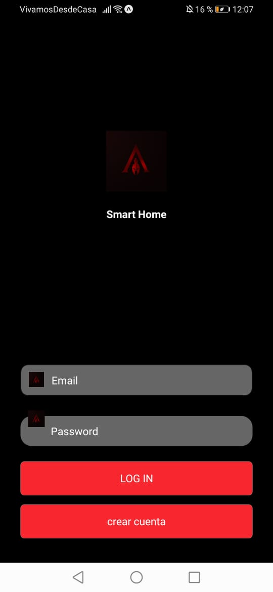

# Prouecto integrador: Dispositivo integrador de recursos

### Definicion

El siguiente consistirá en el desarrollo de un proyecto usando como base la tecnología de React Native y Firebase, 
todo ello haciendo uso de las buenas practicas de la programación.
```


```


## Librerias requeridas del proyecto
"@react-native-community/masked-view": "0.1.5"
"@react-native-firebase/database": "^7.2.1"
"@react-navigation/drawer": "^5.5.0"
"@react-navigation/native": "^5.5.1"
"@react-navigation/stack": "^5.2.10"
"react-native-safe-area-context": "0.6.0"
"react-native-screens": "2.0.0-alpha.12"
"react-native-reanimated": "~1.4.0"
"firebase": "^7.15.0"
"react-native-dotenv": "^0.2.0",
"react-native-elements": "^2.0.2"
"uuid": "^8.1.0"
"base-64": "^0.1.0"
"prop-types": "15.7.2"


# Documentacion

## Manual de usuario

### Onboarding

En cuestiones de funcionamiento, se usara react-navigation para el desplazamiento entre la distintas
Screens, hasta llegar a la LoginScreen.

La siguiente seccion dara un pequeño vistazo de detalles del proyecto
y las tecnologias nucleares que componen el proyecto, como se puede ver a continuacion:


 

 

 

### Login Screen

En cuestiones de funcionamiento, se utilizara la autenticacion de Firebase de una cuenta previamente registrada
, en caso de no tener un email registrado, sera posible acceder a la opcion de registro que se ubica en la zona inferior
, que nos permitira registrar un nuevo Email y una contraseña que se almacenara en la base de datos y autenticacion de FireBase

La siguiente imagen enseña la LoginScreen en un diseño preeliminar como puede verse a continuacion:

 

### Menu principal

En cuestiones de funcionamiento, se utlizara el componente Drawer de la libreria React-Navigaiton v5, con ciertas modificaciones
visuales de despliegue y color, donde usara tambien el componente React-Navigation en las distintas opciones, en este caso seran 
3 opciones de la cual solo Dashboard sera completamente funcional

La siguiente imagen enseña el menu con su diseño final como puede verse a continuacion:

 


### Dashboard

En cuestiones de funcionamiento, utilizara Realtime Database como puente entre la tecnologia mobile y Arduino donde cada uno de los 
botones visualizables cumpliran la funcion de interactuar con las variables de la Database de Firebase, usando las varibles booleanas 
y UseState para el envio de informacion de forma directa. Del otro lado del puente, el NODE MCU leera los valores dentro de la base de datos
para enviar ordenes a los componentes de si deben encenderse o no.

De forma inversa, NODE MCU podra enviar datos, tanto numericos como caracteres, que seran visualizados en la App.

Cabe mencionar destacar que Se recupera informacion desde la base de datos, como el Email del usuario logueado y la lectura enviada por el NODE MCU.

Al momento de presionar cualquiera de los botones, se registrara la fecha de ultimo uso en la base de datos, en la seccion de historial.


 

### NODE MCU

Este dispositivo se tiene configurado el acceso, mediante claves, a la cuenta de Firebase deseada
donde podra interactuar con la variables (Actualizar, modificar, crear y elminar variables de las colecciones de Firebase).

Este modulo Wifi, con la respectiva configuracion de un red, se conectara mientras el dispositivo a conetarse este disponible.  

Este modulo tiene la posibilidad de enviar pulsos de informacion segun el periodo que se le defina, en este caso 3 segundos,
y conectarse de forma automatica a la coleccion definida, y permanecer en continua emision mientras tenga conexion internet 

 


### Componente auxiliar 

En este caso, debido a la carencia de componentes fisicos, el componente utilizado es un sensor 
de gas licuado MQ-5, que genera datos analogos leidos por el NODE, que a su vez, se enviara a la app

 

## Informacion de variables en Firebase

| Nombre | Tipo |
| :---:           |         :---:  |
| AC              | Bool    |
| Fan             | String  |
| led             | int     |
| Light           | Bool    |
| metro           | int     |
| temp            | Bool    |
| Wifi            | Bool    |
| UsoAC           | String  |
| UsoFan          | String  |
| UsoTemp         | String  |
| UsoWifi         | String  |
| UsoLigth        | String  |

 

## Version

0.1.0

## Autor

* **Glenn Julian Castro Duarte** - [Leonjaeger](https://github.com/leonjaeger)


